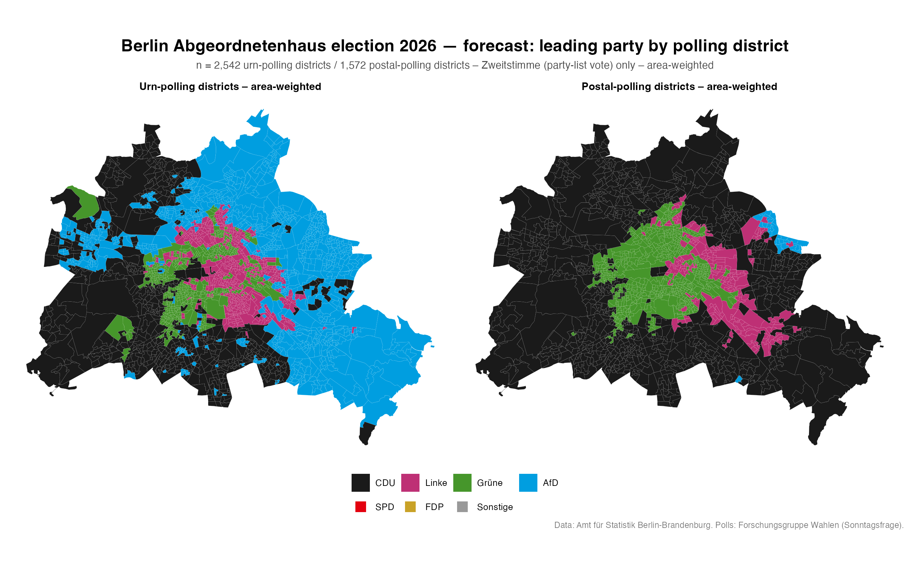
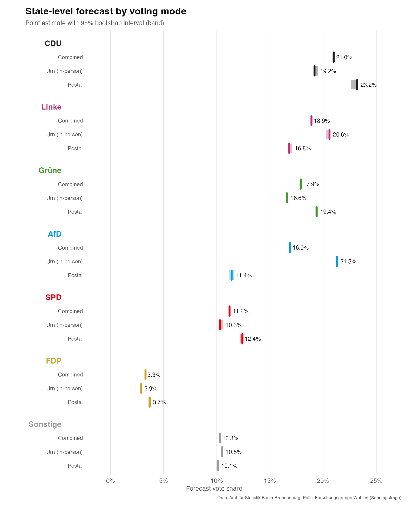

# Berlin Abgeordnetenhauswahl 2026 — Forecast

This is a statistical forecast of the 2026 election to the Berlin Abgeordnetenhaus
(state parliament) which takes place Sunday, the 20th of September 2026. 
The methodology is based on my masters thesis and focuses on forecasting granular
**polling-district level** results for Berlin's 2,542 urn and 1,572 postal polling districts.
Polling district results are further aggregated to the level of the 
78 electoral districts (Wahlkreise), and the state-level. 

The main focus of this forecast is predicting the party-vote shares (Zweitstimmen) of 
all major parties at **polling-district granularity**, and **separately for urn and
postal voting**.

## Forecast at the polling district level

## State-level forecast

Full numbers: [`results/state/combined.csv`](results/state/combined.csv),
[`urn.csv`](results/state/urn.csv), [`postal.csv`](results/state/postal.csv) — and the
same combined/urn/postal split one level down, per Wahlkreis, in
[`results/electoral_district/`](results/electoral_district/).

## Method

This is a **district-level regression forecast**, not a poll aggregator: it predicts each
of Berlin's polling districts individually based on a district's own electoral history and
socio-demographic profile, then aggregates up to Wahlkreis and state level — separately
for urn and postal.

- **Training data**: a harmonized panel of 8 prior Berlin-area elections (Abgeordnetenhaus,
  Bundestag, and European Parliament elections held in Berlin, 2016–2025), each reallocated
  via population-density-weighted (dasymetric) interpolation onto the district boundaries
  that will be used in 2026, so every election is a directly comparable observation of the
  same fixed set of geographic units over time. This is the same general approach as my
  [berlin-election-panel](https://github.com/susannawirthgen/berlin-election-panel) project
  — see that repo for the full methodology, benchmarked accuracy, and underlying data
  sources (results, socio-economic statistics, geometries).
- **Predictors**: each district's own electoral history (a poll-adjusted lag of its prior
  vote shares for all parties) plus socio-demographic and geographic covariates (population
  density, foreign-population share, age/household structure, distance to city centre,
  incumbency, etc.).
- **Model**: elastic net regression, per party, with regularization strength chosen by
  nested walk-forward cross-validation (training only on elections prior to the one being
  predicted, at every step).
- **Poll recalibration**: district-level model output is partially rescaled toward the
  current state-wide poll (25% model / 75% poll blend at the state level, then applied down
  through the district hierarchy).
- **Uncertainty**: The 95% intervals come from a bootstrap over the training data. 
  This solely measures pure estimation/fitting noise.

## Data sources

Historical election results, socio-economic statistics, and district geometries: see
[berlin-election-panel](https://github.com/susannawirthgen/berlin-election-panel#data-sources),
whose sourcing this project shares (primarily Amt für Statistik Berlin-Brandenburg,
released under Datenlizenz Deutschland; population density from Berlin's Umweltatlas).
Polling data: Forschungsgruppe Wahlen "Politbarometer" surveys, as compiled by
wahlrecht.de — [Bundestag polls](https://www.wahlrecht.de/umfragen/politbarometer.htm),
[European Parliament polls](https://www.wahlrecht.de/umfragen/europawahl.htm),
[Berlin state election polls](https://www.wahlrecht.de/umfragen/landtage/berlin.htm).

## License

The results and written material in this repository are released under [CC BY 4.0](LICENSE). 
Underlying source data carries its own licensing; see
above.

## Disclaimer

This is an independent personal/research project, not affiliated with any polling
institute, party, or the Berlin state government. It is a statistical forecast, not a
prediction of certainty — treat it as one input among several, alongside published polls
and other forecasts.
